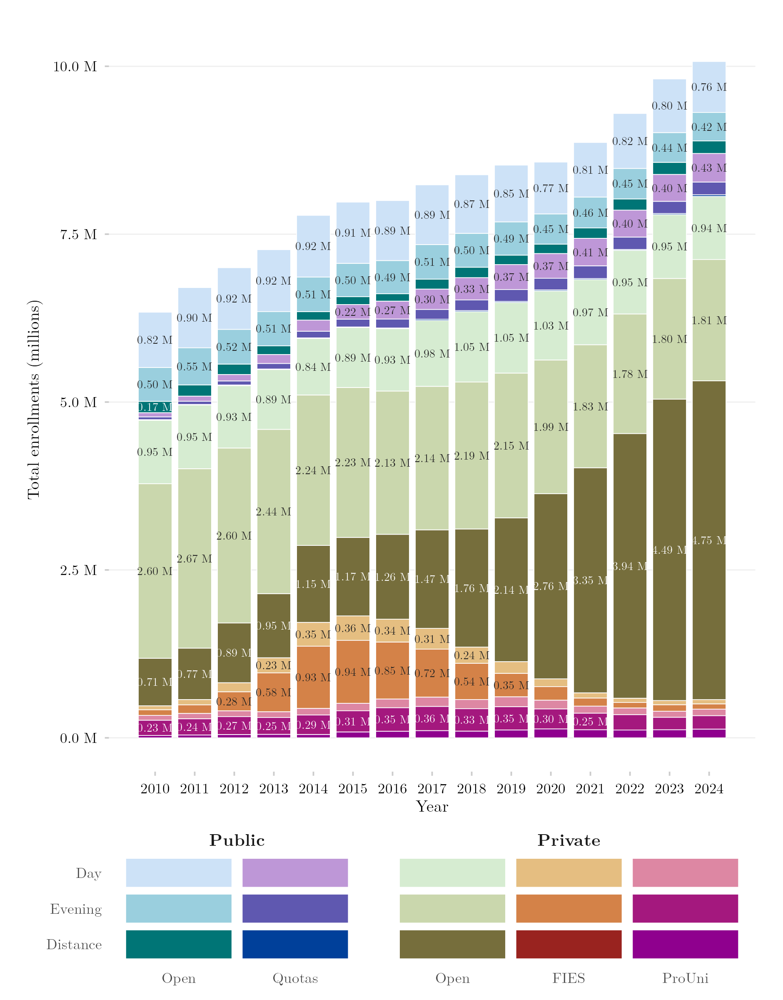

## Overview

This figure breaks down Brazilian higher-education enrollment by sector (public vs. private), access route (how the student got their seat — scholarship, loan, reserved quota, or open admission), and time of day (morning/evening in-person, or distance learning). It offers a detailed map of the different doors through which students enter the system, and how the size of each door has changed.

## Methodology

Built from student-level records of the Higher Education Census (Censo da Educação Superior), extracted via INEP's protected-access platform SEDAP+ (Serviço de Acesso a Dados Protegidos), because INEP stopped publishing the full student-level microdata after 2019. Sector follows the institution's administrative category (public vs. private). Access route is assigned by precedence within the private sector — ProUni scholarship first, then FIES loan among those without ProUni, then open admission — so categories are disjoint by construction. Within the public sector the split is reserved seat (affirmative-action quota) versus open admission. SEDAP+ answers only aggregate queries and applies differential privacy, which in practice suppresses cells with few individuals rather than adding appreciable noise; the extraction groups at exactly the granularity the figure displays, at which no cell is suppressed. Against published microdata for years where both exist, SEDAP+ totals run 0.6% to 1.1% low, a small and systematic gap.

## How to Cite

If you use this figure or the pipeline behind it, please cite both the dissertation and this specific analysis. References follow APA 7th edition.

**Dissertation (in preparation; the entry will be updated after the defense):**

> Mançano, T. (2026). *Inequality in access to tertiary education in Brazil: Household incomes, reforming policies, and the politics of who gets in (1990s–2020s)* [Unpublished master's thesis]. University of São Paulo.

**This figure and pipeline:**

> Mançano, T. (2026, August 5). *Enrollment by sector, access route and time of day* [Figure and reproducible pipeline]. Open Data Analysis. https://mancano-tales.github.io/open-data-analysis/posts/matriculas-turno-via-acesso/

**In text:** (Mançano, 2026) — when citing several analyses from this catalog in the same work, APA distinguishes them as 2026a, 2026b, … in the order they appear in the reference list.

**BibTeX:**

```bibtex
@mastersthesis{Mancano2026Thesis,
  author = {Man\c{c}ano, Tales},
  title  = {Inequality in Access to Tertiary Education in Brazil: Household
            Incomes, Reforming Policies, and the Politics of Who Gets In
            (1990s--2020s)},
  school = {University of S\~{a}o Paulo},
  year   = {2026},
  type   = {Master's thesis},
  note   = {Unpublished; Graduate Program in Political Science}
}

@misc{Mancano2026_matriculas_turno_via_acesso,
  author       = {Man\c{c}ano, Tales},
  title        = {Enrollment by sector, access route and time of day},
  year         = {2026},
  month        = aug,
  howpublished = {Open Data Analysis, \url{https://mancano-tales.github.io/open-data-analysis/posts/matriculas-turno-via-acesso/}},
  note         = {Figure and reproducible pipeline. Source code: \url{https://github.com/mancano-tales/open-data-analysis}, folder posts/matriculas-turno-via-acesso/. Accessed YYYY-MM-DD}
}
```

A permanent version (Git tag + Zenodo DOI) will be linked here once the dissertation is defended; until then, cite the page URL above and add the date you accessed it (source code: https://github.com/mancano-tales/open-data-analysis, folder `posts/matriculas-turno-via-acesso/`).

## Pipeline

Run these scripts in this order, from the project root (each one writes to `data-raw/`, which the next one reads):

1. [`shared-pipeline/sedap/010_SEDAP_Cliente.R`](../../shared-pipeline/sedap/010_SEDAP_Cliente.R) — SEDAP+ API client, sourced by the script below — requires the `SEDAP_TOKEN` environment variable
2. [`shared-pipeline/sedap/020_Extrair_Nicho_2020_2024.R`](../../shared-pipeline/sedap/020_Extrair_Nicho_2020_2024.R) — extracts enrollment by sector × access route × shift/modality from the SUP_ALUNO tables 2010–2024 via SEDAP+ and writes `data-raw/INEP/derived/nicho_agregado_sedap_2010_2024.csv`
3. [`plot.R`](plot.R) — reads `data-raw/INEP/derived/nicho_agregado_sedap_2010_2024.csv`; writes the figure to `output/figures/matriculas-turno-via-acesso/` — compare it with this post's `thumbnail.png`

The SEDAP+ steps only run with an approved INEP credential exported as `SEDAP_TOKEN` (see Reproducibility below); the extracted CSV is not redistributed here.

## Reproducibility

**Tier: B**

This pipeline depends on restricted INEP data accessible via SEDAP+ credentials (`SEDAP_TOKEN` environment variable). Without an approved credential, the scripts in `shared-pipeline/sedap/` will not run — the logic remains available for audit, but full reproduction requires requesting access.
