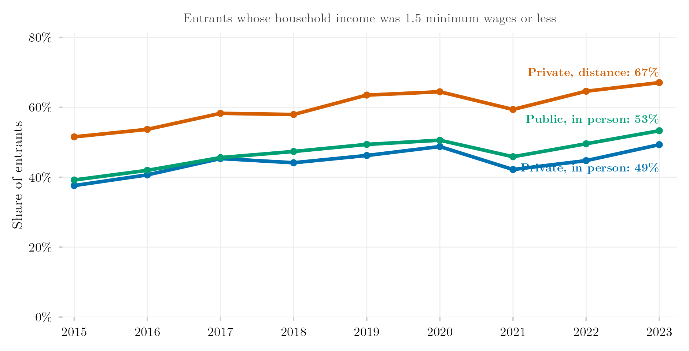

## Overview

This figure compares the household income profile of students entering higher education through different sectors and modes of delivery (distance vs. in-person). It shows whether distance learning and in-person study, and public vs. private institutions, draw their entering classes from different points of the income distribution.

## Methodology

Household income profile of entrants by mode of delivery (distance vs. in-person), drawn from a SEDAP+ extraction crossing ENEM (Brazil's national high-school exam, which reports household income) with Higher Education Census enrollment records. Income bands come from the socioeconomic questionnaire filled out by every ENEM examinee, allowing the entering student's declared per-capita household income to be classified against the same income bands used elsewhere in this project.

## How to Cite

If you use this figure or the pipeline behind it, please cite both the dissertation and this specific analysis. References follow APA 7th edition.

**Dissertation (in preparation; the entry will be updated after the defense):**

> Mançano, T. (2026). *Inequality in access to tertiary education in Brazil: Household incomes, reforming policies, and the politics of who gets in (1990s–2020s)* [Unpublished master's thesis]. University of São Paulo.

**This figure and pipeline:**

> Mançano, T. (2026, August 6). *Household income of entrants by sector and mode of delivery* [Figure and reproducible pipeline]. Open Data Analysis. https://mancano-tales.github.io/open-data-analysis/posts/perfil-renda-modalidade/

**In text:** (Mançano, 2026) — when citing several analyses from this catalog in the same work, APA distinguishes them as 2026a, 2026b, … in the order they appear in the reference list.

**BibTeX:**

```bibtex
@mastersthesis{Mancano2026Thesis,
  author = {Man\c{c}ano, Tales},
  title  = {Inequality in Access to Tertiary Education in Brazil: Household
            Incomes, Reforming Policies, and the Politics of Who Gets In
            (1990s--2020s)},
  school = {University of S\~{a}o Paulo},
  year   = {2026},
  type   = {Master's thesis},
  note   = {Unpublished; Graduate Program in Political Science}
}

@misc{Mancano2026_perfil_renda_modalidade,
  author       = {Man\c{c}ano, Tales},
  title        = {Household income of entrants by sector and mode of delivery},
  year         = {2026},
  month        = aug,
  howpublished = {Open Data Analysis, \url{https://mancano-tales.github.io/open-data-analysis/posts/perfil-renda-modalidade/}},
  note         = {Figure and reproducible pipeline. Source code: \url{https://github.com/mancano-tales/open-data-analysis}, folder posts/perfil-renda-modalidade/. Accessed YYYY-MM-DD}
}
```

A permanent version (Git tag + Zenodo DOI) will be linked here once the dissertation is defended; until then, cite the page URL above and add the date you accessed it (source code: https://github.com/mancano-tales/open-data-analysis, folder `posts/perfil-renda-modalidade/`).

## Pipeline

Run these scripts in this order, from the project root (each one writes to `data-raw/`, which the next one reads):

1. [`shared-pipeline/sedap/010_SEDAP_Cliente.R`](../../shared-pipeline/sedap/010_SEDAP_Cliente.R) — SEDAP+ API client, sourced by the script below — requires the `SEDAP_TOKEN` environment variable
2. [`shared-pipeline/sedap/070_Perfil_Renda_Modalidade.R`](../../shared-pipeline/sedap/070_Perfil_Renda_Modalidade.R) — extracts the income profile of entrants by modality from SEDAP+ and writes `data-raw/sedap/extraido_perfil_renda_modalidade_2014_2024.csv`
3. [`plot.R`](plot.R) — reads `data-raw/sedap/extraido_perfil_renda_modalidade_2014_2024.csv`; writes the figure to `output/figures/perfil-renda-modalidade/` — compare it with this post's `thumbnail.png`

The SEDAP+ steps only run with an approved INEP credential exported as `SEDAP_TOKEN` (see Reproducibility below); the extracted CSV is not redistributed here.

## Reproducibility

**Tier: B**

This pipeline depends on restricted INEP data accessible via SEDAP+ credentials (`SEDAP_TOKEN` environment variable). Without an approved credential, the scripts in `shared-pipeline/sedap/` will not run — the logic remains available for audit, but full reproduction requires requesting access.
