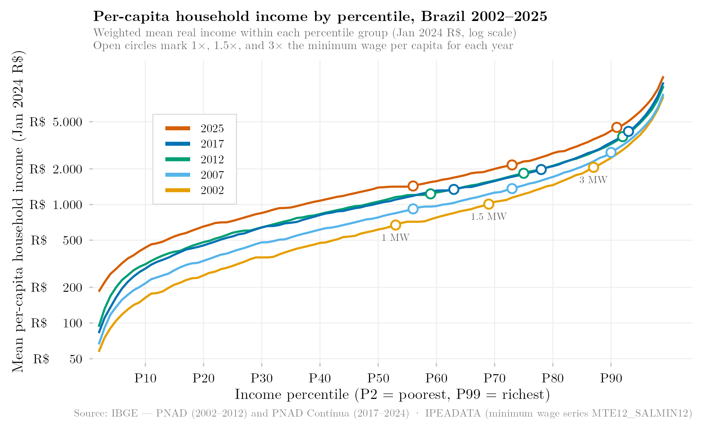

## Overview

This figure plots average household income across the entire income distribution, from the poorest to the richest percentile, for a selection of years, using a logarithmic vertical axis. The log scale compresses the very large gap between the top and bottom of the distribution, making it easier to compare proportional differences across the full range of percentiles — including the lower and middle percentiles that a linear scale would otherwise compress into an almost flat line. Reference markers show where income crosses one, one-and-a-half, and three times the minimum wage.

## Methodology

This figure follows the identical methodology of the linear-scale version of this analysis, with the y-axis rendered on a logarithmic scale instead of linear. Each line shows the weighted mean real per-capita household income (deflated to January 2024 prices via the IPCA) within each income percentile group, for the selected years. Percentiles rank all individuals with strictly positive per-capita household income by income, using sampling weights. For 2012, only the PNAD Anual sample is used. Open circles mark the percentile at which mean per-capita household income equals one (1 MW), one-and-a-half (1.5 MW), and three (3 MW) times the national minimum wage in force in January of that year, deflated to January 2024 prices via `deflateBR`.

## How to Cite

If you use this figure or its underlying pipeline, please cite both the dissertation and this repository.

**Dissertation:**

> Mançano, Tales. 2026. *Inequality in Access to Tertiary Education in Brazil: Household Incomes, Reforming Policies, and the Politics of Who Gets In (1990s–2020s)*. Master's thesis, Graduate Program in Political Science, University of São Paulo.

```bibtex
@mastersthesis{Mancano2026,
  author = {Man\c{c}ano, Tales},
  title  = {Inequality in Access to Tertiary Education in Brazil: Household
            Incomes, Reforming Policies, and the Politics of Who Gets In
            (1990s--2020s)},
  school = {University of S\~{a}o Paulo},
  year   = {2026},
  type   = {Master's thesis},
  note   = {Graduate Program in Political Science}
}
```

**This figure and pipeline:**

> Mançano, Tales. 2026. "Average Household Income by Income Percentile (Log Scale)." In *Open Data Analysis*. <https://github.com/mancano-tales/open-data-analysis>, `posts/renda-centil-log/`.

```bibtex
@misc{Mancano2026OpenDataAnalysis,
  author       = {Man\c{c}ano, Tales},
  title        = {Open Data Analysis: Average Household Income by Income Percentile (Log Scale)},
  year         = {2026},
  howpublished = {\url{https://github.com/mancano-tales/open-data-analysis}},
  note         = {posts/renda-centil-log/}
}
```

A permanent version (Git tag + Zenodo DOI) will be linked here once the dissertation is defended; until then, cite the repository URL above.

## Pipeline

Scripts for this analysis:

- Plotting: [`plot.R`](plot.R)
- Upstream pipeline:
  - [`shared-pipeline/pnadc/035_Splice_Microdados.R`](../../shared-pipeline/pnadc/035_Splice_Microdados.R)

## Reproducibility

**Tier: A**

This pipeline uses only public data, accessible via package/API without any credential (PNADcIBGE, censobr, sidrar, ipeadatar). Run the scripts in `shared-pipeline/` in numeric order to reconstruct the intermediate data.
