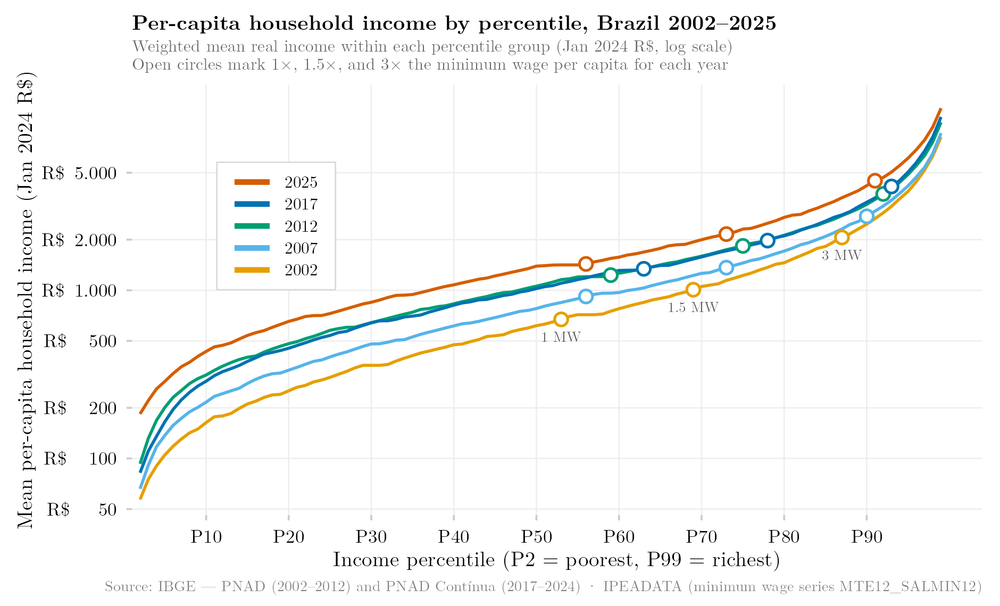

## Overview

This figure plots average household income across the entire income distribution, from the poorest to the richest percentile, for a selection of years, using a logarithmic vertical axis. The log scale compresses the very large gap between the top and bottom of the distribution, making it easier to compare proportional differences across the full range of percentiles — including the lower and middle percentiles that a linear scale would otherwise compress into an almost flat line. Reference markers show where income crosses one, one-and-a-half, and three times the minimum wage.

## Methodology

This figure follows the identical methodology of the linear-scale version of this analysis, with the y-axis rendered on a logarithmic scale instead of linear. Each line shows the weighted mean real per-capita household income (deflated to January 2024 prices via the IPCA) within each income percentile group, for the selected years. Percentiles rank all individuals with strictly positive per-capita household income by income, using sampling weights. For 2012, only the PNAD Anual sample is used. Open circles mark the percentile at which mean per-capita household income equals one (1 MW), one-and-a-half (1.5 MW), and three (3 MW) times the national minimum wage in force in January of that year, deflated to January 2024 prices via `deflateBR`.

## How to Cite

If you use this figure or the pipeline behind it, please cite both the dissertation and this specific analysis. References follow APA 7th edition.

**Dissertation (in preparation; the entry will be updated after the defense):**

> Mançano, T. (2026). *Inequality in access to tertiary education in Brazil: Household incomes, reforming policies, and the politics of who gets in (1990s–2020s)* [Unpublished master's thesis]. University of São Paulo.

**This figure and pipeline:**

> Mançano, T. (2026, August 9). *Average household income by income percentile (log scale)* [Figure and reproducible pipeline]. Open Data Analysis. https://mancano-tales.github.io/open-data-analysis/posts/renda-centil-log/

**In text:** (Mançano, 2026) — when citing several analyses from this catalog in the same work, APA distinguishes them as 2026a, 2026b, … in the order they appear in the reference list.

**BibTeX:**

```bibtex
@mastersthesis{Mancano2026Thesis,
  author = {Man\c{c}ano, Tales},
  title  = {Inequality in Access to Tertiary Education in Brazil: Household
            Incomes, Reforming Policies, and the Politics of Who Gets In
            (1990s--2020s)},
  school = {University of S\~{a}o Paulo},
  year   = {2026},
  type   = {Master's thesis},
  note   = {Unpublished; Graduate Program in Political Science}
}

@misc{Mancano2026_renda_centil_log,
  author       = {Man\c{c}ano, Tales},
  title        = {Average household income by income percentile (log scale)},
  year         = {2026},
  month        = aug,
  howpublished = {Open Data Analysis, \url{https://mancano-tales.github.io/open-data-analysis/posts/renda-centil-log/}},
  note         = {Figure and reproducible pipeline. Source code: \url{https://github.com/mancano-tales/open-data-analysis}, folder posts/renda-centil-log/. Accessed YYYY-MM-DD}
}
```

A permanent version (Git tag + Zenodo DOI) will be linked here once the dissertation is defended; until then, cite the page URL above and add the date you accessed it (source code: https://github.com/mancano-tales/open-data-analysis, folder `posts/renda-centil-log/`).

## Pipeline

This figure draws on the [PNAD / PNAD Contínua Harmonization, 1992–2025](../harmonizacao-pnad-pnadc/) panel.

Run these scripts in this order, from the project root (each one writes to `data-raw/`, which the next one reads):

1. [`shared-pipeline/pnadc/000_PNADC_Download_Consolidate.R`](../../shared-pipeline/pnadc/000_PNADC_Download_Consolidate.R) — downloads PNAD Contínua 2012–2025 (1st interview) with `PNADcIBGE::get_pnadc()` into `data-raw/pnadc_raw/` and consolidates it into `data-raw/pnadc_consolidado_2012_2025_interview1.rds`
2. [`shared-pipeline/pnadc/020_PNAD_Anual_Manual_Import_2001_2015.R`](../../shared-pipeline/pnadc/020_PNAD_Anual_Manual_Import_2001_2015.R) — downloads the PNAD Anual 2001–2015 microdata from the IBGE FTP into `data-raw/pnad_anual_raw/` and imports them into `data-raw/harmonizing-br-data/output/PNAD_Anual_2001_2015.parquet`
3. [`shared-pipeline/pnadc/050_PNAD_Historica_Manual_Import_1992_1999.R`](../../shared-pipeline/pnadc/050_PNAD_Historica_Manual_Import_1992_1999.R) — same for PNAD Anual 1992–1999 (`PNAD_Anual_1992_1999.parquet`)
4. [`shared-pipeline/pnadc/035_Splice_Microdados.R`](../../shared-pipeline/pnadc/035_Splice_Microdados.R) — splices PNAD Anual and PNAD Contínua into the harmonized panel — `Microdados_Todas_Idades_1992_2025.parquet` and `Microdados_Jovens_18_24_1992_2025.parquet` in `data-raw/harmonizing-br-data/output/` (sources `shared-pipeline/utils/codigos_curso_pnad.R`)
5. [`plot.R`](plot.R) — reads `Microdados_Todas_Idades_1992_2025.parquet`; the minimum-wage series is fetched online from IPEADATA (`ipeadatar`) on first run; writes the figure to `output/figures/renda-centil-log/` — compare it with this post's `thumbnail.png`

All of the upstream steps above are Tier A and are also run, in this same order, by [`shared-pipeline/build_public_data.R`](../../shared-pipeline/build_public_data.R).

## Reproducibility

**Tier: A**

This pipeline uses only public data, accessible via package/API without any credential (PNADcIBGE, censobr, sidrar, ipeadatar). Run the scripts in `shared-pipeline/` in numeric order to reconstruct the intermediate data.
