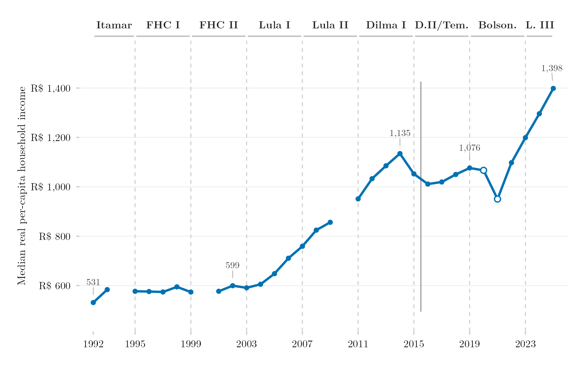

## Overview

This figure tracks the income available to the Brazilian household in the middle of the distribution: the weighted median of real per-capita household income, in January 2024 reais, from 1992 to 2025. The median is reported rather than the mean because the mean runs between 1.5 and 1.7 times the median over the period and moves with the top decile in a way a level series for the typical household does not require. The series is built by a dedicated extraction from the raw PNAD and PNAD Contínua microdata (IBGE), with the household as the unit of income throughout and households reporting no income retained, as in the IBGE's own convention.

## Methodology

The unit of income is the household throughout: for PNAD Anual (1992–2015) the numerator is `V4721`, the IBGE household income aggregate, which excludes the income of lodgers, domestic workers and their relatives, and the denominator is the count of residents outside those same three conditions (`V0401` not in 6, 7, 8); from 2016 the PNAD Contínua supplies `VD5008`, already per-capita household income on the same convention. The universe is the official one, retaining households that report no income; excluding them raises the median by 4.9% in 2003, 2.4% in 2009 and 1.4% in 2014. Values are deflated by the IPCA to January 2024. The line is interrupted in 1994, 2000 and 2010, when no PNAD was fielded. The hollow markers for 2020 and 2021 come from the fifth visit of the PNAD Contínua, the only annual file for those years, collected largely by telephone, a mode known to under-enumerate income and to under-represent poorer and rural households; they are indicative rather than comparable. The solid vertical rule marks the change of survey in 2015–2016; the step is not rescaled away. On the four overlap years, with the unit of income made homogeneous on both sides, the PNAD Contínua median runs 5.0%, 4.1% and 3.7% below the PNAD Anual median in 2012–2014 and 0.8% above it in 2015 (average −2.6%). The household construction follows the procedure documented in the replication package released by Souza and Hecksher (2026) with their study of Brazilian household income, kindly shared by Pedro H. G. Ferreira de Souza; when that package's `results/renda.csv` is placed in `data-raw/Souza-Hecksher/`, `plot.R` prints the year-by-year comparison against it. Government labels indicate the president in office.

## How to Cite

If you use this figure or the pipeline behind it, please cite both the dissertation and this specific analysis. References follow APA 7th edition.

**Dissertation (in preparation; the entry will be updated after the defense):**

> Mançano, T. (2026). *Inequality in access to tertiary education in Brazil: Household incomes, reforming policies, and the politics of who gets in (1990s–2020s)* [Unpublished master's thesis]. University of São Paulo.

**This figure and pipeline:**

> Mançano, T. (2026, September 16). *Median real household income per capita, Brazil 1992–2025* [Figure and reproducible pipeline]. Open Data Analysis. https://mancano-tales.github.io/open-data-analysis/posts/renda-mediana-domiciliar-pc/

**In text:** (Mançano, 2026) — when citing several analyses from this catalog in the same work, APA distinguishes them as 2026a, 2026b, … in the order they appear in the reference list.

**BibTeX:**

```bibtex
@mastersthesis{Mancano2026Thesis,
  author = {Man\c{c}ano, Tales},
  title  = {Inequality in Access to Tertiary Education in Brazil: Household
            Incomes, Reforming Policies, and the Politics of Who Gets In
            (1990s--2020s)},
  school = {University of S\~{a}o Paulo},
  year   = {2026},
  type   = {Master's thesis},
  note   = {Unpublished; Graduate Program in Political Science}
}

@misc{Mancano2026_renda_mediana_domiciliar_pc,
  author       = {Man\c{c}ano, Tales},
  title        = {Median real household income per capita, Brazil 1992--2025},
  year         = {2026},
  month        = sep,
  howpublished = {Open Data Analysis, \url{https://mancano-tales.github.io/open-data-analysis/posts/renda-mediana-domiciliar-pc/}},
  note         = {Figure and reproducible pipeline. Source code: \url{https://github.com/mancano-tales/open-data-analysis}, folder posts/renda-mediana-domiciliar-pc/. Accessed YYYY-MM-DD}
}
```

A permanent version (Git tag + Zenodo DOI) will be linked here once the dissertation is defended; until then, cite the page URL above and add the date you accessed it (source code: https://github.com/mancano-tales/open-data-analysis, folder `posts/renda-mediana-domiciliar-pc/`).

## Pipeline

This figure does **not** read the harmonized panel used by most posts: it extracts household income directly from the raw microdata, because the panel carries family (not household) income until 2015 and drops zero-income households. It reuses the raw files that the panel's import scripts download.

Run these scripts in this order, from the project root (each one writes to `data-raw/`, which the next one reads):

1. [`shared-pipeline/pnadc/000_PNADC_Download_Consolidate.R`](../../shared-pipeline/pnadc/000_PNADC_Download_Consolidate.R) — downloads PNAD Contínua 2012–2025 (1st interview) with `PNADcIBGE::get_pnadc()` into `data-raw/pnadc_raw/` and consolidates it into `data-raw/pnadc_consolidado_2012_2025_interview1.rds`
2. [`shared-pipeline/pnadc/050_PNAD_Historica_Manual_Import_1992_1999.R`](../../shared-pipeline/pnadc/050_PNAD_Historica_Manual_Import_1992_1999.R) — downloads the raw PNAD Anual 1992–1999 microdata (fixed-width files + SAS layouts) from the IBGE FTP into `data-raw/pnad_anual_raw/<year>/` — `plot.R` reads these raw files directly
3. [`shared-pipeline/pnadc/020_PNAD_Anual_Manual_Import_2001_2015.R`](../../shared-pipeline/pnadc/020_PNAD_Anual_Manual_Import_2001_2015.R) — same for PNAD Anual 2001–2015
4. [`shared-pipeline/pnadc/022_PNADC_Visita5_2020_2021.R`](../../shared-pipeline/pnadc/022_PNADC_Visita5_2020_2021.R) — *(optional)* downloads the fifth-visit PNAD Contínua files for 2019–2022 from the IBGE FTP into `data-raw/pnadc_raw/` and writes `data-raw/harmonizing-br-data/output/PNADC_Visita5_2019_2022.parquet`; without it, the figure is drawn without the hollow 2020–2021 markers
5. [`plot.R`](plot.R) — reads the raw PNAD Anual files, the PNAD Contínua cache and (if present) the fifth-visit parquet; caches the extracted series in `data-raw/harmonizing-br-data/output/242_serie_renda_domiciliar.rds` (delete it to re-extract); writes the figure to `output/figures/renda-mediana-domiciliar-pc/` — compare it with this post's `thumbnail.png`

All of the upstream steps above are Tier A and are also run, in this same order, by [`shared-pipeline/build_public_data.R`](../../shared-pipeline/build_public_data.R).

## Reproducibility

**Tier: A**

This figure uses only public data, accessible without any credential (PNADcIBGE and the IBGE FTP). The raw-microdata extraction reads every PNAD Anual file from 1992 to 2015 and takes tens of minutes after the downloads; the cache in `data-raw/` makes later runs immediate. The optional comparison against Souza and Hecksher's replication package requires their `results/renda.csv`, which is not redistributed here.
