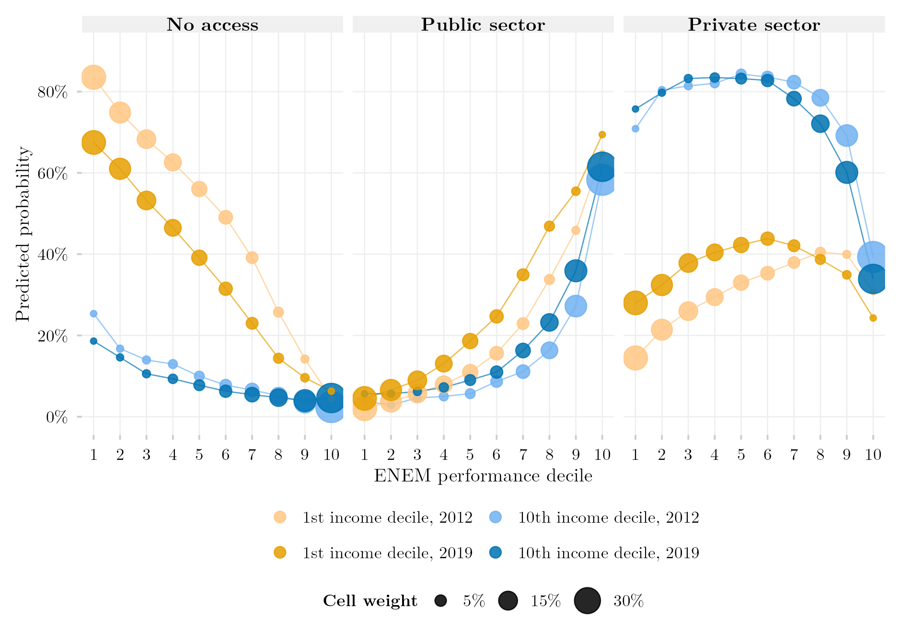

## Overview

This figure replicates Figure 3 of Senkevics, Barbosa, Carvalhaes and Ribeiro (2024) for the cohort of students in the final year of secondary school in 2012, and extends it to the 2019 cohort. For the poorest and the richest income deciles, it shows the probability of entering no tertiary institution, a public one or a private one within five years, by decile of ENEM performance. Circle area is the conditional distribution of performance within each income decile. The data are linked administrative records (Censo Escolar, ENEM, Censo da Educação Superior) queried through INEP's SEDAP+ platform, which returns aggregate tables under differential privacy; the 300-cell contingency tables that the figure reads are redistributed with this post, so the figure itself reproduces without a credential.

## Methodology

**Design.** The cohort is every student enrolled in the final year of secondary education in the Censo Escolar of the cohort year (`TP_ETAPA_ENSINO` in 27, 28, 29, 32, 33, 34, 37, 38), aged 16–22, followed in the ENEM editions of the next five years and in the Censo da Educação Superior of the five years after that; a student counts as having entered if any first enrollment appears in the window, and the sector is that of the earliest one (`TP_CATEGORIA_ADMINISTRATIVA` 1–3 public, 4–9 private). Performance is the mean of the four objective ENEM tests, converted to deciles within the cohort. Family income per capita divides the midpoint of the declared income band (in minimum wages of the ENEM edition, deflated by the INPC to March 2023) by the declared number of household members, cut into deciles within the cohort. Constants are taken from the authors' replication package (`015_Especificacao.R` records the source line of each). The analytic samples are 977,450 students (2012) and 746,852 (2019), in 300 cells each.

**Estimation.** Predicted probabilities come from a multinomial logit of destination on the full interaction of income decile and performance decile, fitted with `nnet::multinom` on the contingency table with cell counts as weights — the authors' reduced specification. With one parameter per cell the model is saturated, so predictions coincide with observed cell proportions; the published figure adds controls (sex, colour, age, school network, rural location, state, ENEM edition), which is why its levels differ where composition differs most between income strata.

**Departures from the original, forced by the access layer.** SEDAP+ returns only aggregate queries under differential privacy ($\varepsilon = 1$). (D1) The cohort is students *enrolled* in the final year, not approved completers. (D2) The eight controls are omitted. (D3) A student with several ENEM sittings is scored on the *last* edition. (D4) No random tie-breaker for simultaneous enrollments; the earliest year decides. (D5) Cell counts carry privacy noise of about three students per cell (at most 27 observed). (D6) Income bands are anchored to the minimum wage printed in each edition's questionnaire. (D7) Students without a socio-economic questionnaire are excluded (330 in 2012, 2,091 in 2019). Validation for 2012: 74.8% private / 25.2% public among entrants (published 75.8 / 24.2); 67.1% of the cohort entering within five years (published 68.9%).

**Reading the two cohorts.** Deciles are cut within each cohort, so a decile is a relative position among that cohort's examinees. Coverage of the school cohort falls from 44.9% (2012) to 35.0% (2019), because fewer students have a linkable CPF and ENEM participation collapsed in the pandemic editions. The smallest cell has 749 students and every 95% Wilson interval is narrower than ±3.3 percentage points; no intervals are drawn. Between the cohorts the poorest decile's probability of non-access falls by 14–18 points across performance deciles 1–7, and its private-sector entry at the lowest performance decile doubles; the richest decile moves little.

## How to Cite

If you use this figure or the pipeline behind it, please cite both the dissertation and this specific analysis, and the original article being replicated. References follow APA 7th edition.

**Original article:**

> Senkevics, A., Barbosa, R., Carvalhaes, F., & Ribeiro, C. C. (2024). Decomposing heterogeneity in inequality of educational opportunities: Family income and academic performance in Brazilian higher education. *Sociological Science, 11*, 854–885. https://doi.org/10.15195/v11.a31

**Dissertation (in preparation; the entry will be updated after the defense):**

> Mançano, T. (2026). *Inequality in access to tertiary education in Brazil: Household incomes, reforming policies, and the politics of who gets in (1990s–2020s)* [Unpublished master's thesis]. University of São Paulo.

**This figure and pipeline:**

> Mançano, T. (2026, September 14). *Access by ENEM performance and income decile: The 2012 and 2019 cohorts (replication of Senkevics et al., 2024)* [Figure and reproducible pipeline]. Open Data Analysis. https://mancano-tales.github.io/open-data-analysis/posts/replicacao-senkevics2024-coortes/

**In text:** (Mançano, 2026) — when citing several analyses from this catalog in the same work, APA distinguishes them as 2026a, 2026b, … in the order they appear in the reference list.

**BibTeX:**

```bibtex
@mastersthesis{Mancano2026Thesis,
  author = {Man\c{c}ano, Tales},
  title  = {Inequality in Access to Tertiary Education in Brazil: Household
            Incomes, Reforming Policies, and the Politics of Who Gets In
            (1990s--2020s)},
  school = {University of S\~{a}o Paulo},
  year   = {2026},
  type   = {Master's thesis},
  note   = {Unpublished; Graduate Program in Political Science}
}

@misc{Mancano2026_replicacao_senkevics2024_coortes,
  author       = {Man\c{c}ano, Tales},
  title        = {Access by ENEM performance and income decile: The 2012 and 2019 cohorts (replication of Senkevics et al., 2024)},
  year         = {2026},
  month        = sep,
  howpublished = {Open Data Analysis, \url{https://mancano-tales.github.io/open-data-analysis/posts/replicacao-senkevics2024-coortes/}},
  note         = {Figure and reproducible pipeline. Source code: \url{https://github.com/mancano-tales/open-data-analysis}, folder posts/replicacao-senkevics2024-coortes/. Accessed YYYY-MM-DD}
}
```

A permanent version (Git tag + Zenodo DOI) will be linked here once the dissertation is defended; until then, cite the page URL above and add the date you accessed it (source code: https://github.com/mancano-tales/open-data-analysis, folder `posts/replicacao-senkevics2024-coortes/`).

## Pipeline

The figure reads two aggregated tables redistributed in this post's [`data/`](data/) folder — [`coorte_2012_030_matriz_final.csv`](data/coorte_2012_030_matriz_final.csv) and [`coorte_2019_030_matriz_final.csv`](data/coorte_2019_030_matriz_final.csv), each with 300 rows (`income_D`, `performance`, `choice`, `n`). To draw the figure from them:

1. [`plot.R`](plot.R) — fits the saturated multinomial logit per cohort and writes the figure to `output/figures/replicacao-senkevics2024-coortes/` — compare it with this post's `thumbnail.png`

To re-extract the tables from the linked microdata (requires an INEP SEDAP+ credential exported as `SEDAP_TOKEN`), run, from the project root and once per cohort with `COORTE_ANO=2012` and `COORTE_ANO=2019` in the environment:

1. [`shared-pipeline/sedap/010_SEDAP_Cliente.R`](../../shared-pipeline/sedap/010_SEDAP_Cliente.R) — SEDAP+ API client, sourced by the scripts below
2. [`shared-pipeline/sedap/senkevics/015_Especificacao.R`](../../shared-pipeline/sedap/senkevics/015_Especificacao.R) — every constant of the design (cohort year, ENEM and Censo Superior windows, income-band midpoints, deflator), each annotated with its source line in the authors' replication package; sourced by the scripts below
3. [`shared-pipeline/sedap/senkevics/010_Coorte.R`](../../shared-pipeline/sedap/senkevics/010_Coorte.R) — sizes the cohort and measures how much of it links to the ENEM
4. [`shared-pipeline/sedap/senkevics/020_Distribuicoes_Marginais.R`](../../shared-pipeline/sedap/senkevics/020_Distribuicoes_Marginais.R) — marginal distributions of income and score needed for the decile cut-points
5. [`shared-pipeline/sedap/senkevics/025_Pontos_Corte.R`](../../shared-pipeline/sedap/senkevics/025_Pontos_Corte.R) — computes the income and performance decile cut-points
6. [`shared-pipeline/sedap/senkevics/030_Extrair_Matriz_Final.R`](../../shared-pipeline/sedap/senkevics/030_Extrair_Matriz_Final.R) — queries the 300-cell table and writes `data-raw/sedap/senkevics/coorte_<year>/030_matriz_final.csv`; when that file exists, `plot.R` reads it in preference to the redistributed copy

## Reproducibility

**Tier: B** — figure reproducible without credentials from the redistributed aggregate tables; re-extraction requires SEDAP+ access.

The aggregate tables carry no individual record: each row is a count of students in a cell of ten income deciles × ten performance deciles × three destinations, the smallest cell holding 749 students, and the counts already include the platform's differential-privacy noise. The extraction scripts in `shared-pipeline/sedap/senkevics/` only run with an approved INEP credential exported as `SEDAP_TOKEN`; without one, their logic remains available for audit.
