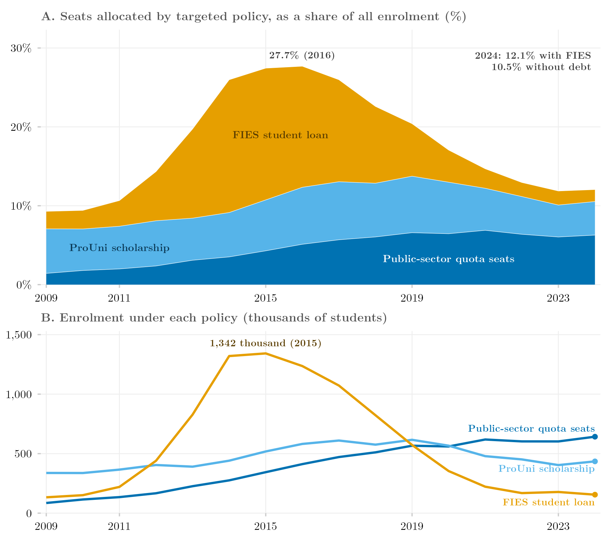

## Overview

This figure asks how much of Brazilian higher education is allocated by a need-based criterion. It stacks the three instruments that assign a seat on public-school origin, family income, race or disability — reserved (quota) seats in the public network, ProUni scholarships and FIES loans in the private network — as a share of all enrollment (Panel A) and in absolute numbers (Panel B), from 2009 to 2024. Open-competition public seats, which are free but not targeted, are excluded. Quota seats and ProUni share a colour family because neither creates debt; FIES is a loan and is kept apart. Data are the public course-level microdata of INEP's Censo da Educação Superior.

## Methodology

Each year is aggregated from the `CADASTRO_CURSOS` file of the public Censo da Educação Superior microdata: sector from `TP_CATEGORIA_ADMINISTRATIVA` (1–3 public, otherwise private); enrollment (`QT_MAT`); reserved seats (`QT_MAT_RESERVA_VAGA`); ProUni as the sum of full and partial scholarships (`QT_MAT_PROUNII + QT_MAT_PROUNIP`); FIES (`QT_MAT_FIES`). ProUni and FIES are counted in the private network only and quota seats in the public network only; records outside the legal network are filling noise (< 0.1%). The overlap between partial ProUni and FIES cannot be separated and the two are treated as disjoint. "Seats" are enrollment stocks, not places offered. `QT_MAT_RESERVA_VAGA` counts every student enrolled through any reservation programme the Census records — public-school, income, race, disability and "other" — including institutional programmes that predate Law 12,711/2012; the subtype fields (`QT_MAT_RV_*`) exist in the microdata but are not used here, so the figure cannot separate the federal quota law from earlier and state-level schemes. The targeted share rises from 9.2% of enrollment in 2009 to 27.7% in 2016 and falls back to 12.1% in 2024; almost all of the bulge is FIES, which peaks at 1.34 million contracts in 2015. The no-debt portion (quota seats plus ProUni) rises from 7.0% to 13.7% in 2019 and settles at 10.5%; within it, ProUni falls from 616 thousand (2019) to 435 thousand (2024) while quota enrollment grows from 85 thousand to 642 thousand and has been the largest of the three instruments in absolute terms since 2021.

## How to Cite

If you use this figure or the pipeline behind it, please cite both the dissertation and this specific analysis. References follow APA 7th edition.

**Dissertation (in preparation; the entry will be updated after the defense):**

> Mançano, T. (2026). *Inequality in access to tertiary education in Brazil: Household incomes, reforming policies, and the politics of who gets in (1990s–2020s)* [Unpublished master's thesis]. University of São Paulo.

**This figure and pipeline:**

> Mançano, T. (2026, September 19). *Seats allocated by targeted access policy, 2009–2024* [Figure and reproducible pipeline]. Open Data Analysis. https://mancano-tales.github.io/open-data-analysis/posts/vagas-focalizadas/

**In text:** (Mançano, 2026) — when citing several analyses from this catalog in the same work, APA distinguishes them as 2026a, 2026b, … in the order they appear in the reference list.

**BibTeX:**

```bibtex
@mastersthesis{Mancano2026Thesis,
  author = {Man\c{c}ano, Tales},
  title  = {Inequality in Access to Tertiary Education in Brazil: Household
            Incomes, Reforming Policies, and the Politics of Who Gets In
            (1990s--2020s)},
  school = {University of S\~{a}o Paulo},
  year   = {2026},
  type   = {Master's thesis},
  note   = {Unpublished; Graduate Program in Political Science}
}

@misc{Mancano2026_vagas_focalizadas,
  author       = {Man\c{c}ano, Tales},
  title        = {Seats allocated by targeted access policy, 2009--2024},
  year         = {2026},
  month        = sep,
  howpublished = {Open Data Analysis, \url{https://mancano-tales.github.io/open-data-analysis/posts/vagas-focalizadas/}},
  note         = {Figure and reproducible pipeline. Source code: \url{https://github.com/mancano-tales/open-data-analysis}, folder posts/vagas-focalizadas/. Accessed YYYY-MM-DD}
}
```

A permanent version (Git tag + Zenodo DOI) will be linked here once the dissertation is defended; until then, cite the page URL above and add the date you accessed it (source code: https://github.com/mancano-tales/open-data-analysis, folder `posts/vagas-focalizadas/`).

## Pipeline

Run these scripts in this order, from the project root (each one writes to `data-raw/`, which the next one reads):

1. [`shared-pipeline/censup/001_Code_Download_Decompress_all_Public_CENSUP_data.R`](../../shared-pipeline/censup/001_Code_Download_Decompress_all_Public_CENSUP_data.R) — downloads and decompresses the public Censo da Educação Superior microdata for 2009–2024 from INEP into `data-raw/INEP/CENSUP_Publico/<year>/dados/`
2. [`plot.R`](plot.R) — aggregates each year's `CADASTRO_CURSOS` file by sector (caching the result in `data-raw/INEP/derived/censup_agg_vagas_focalizadas.rds`); writes the figure to `output/figures/vagas-focalizadas/` — compare it with this post's `thumbnail.png`

The upstream step is Tier A and is also run by [`shared-pipeline/build_public_data.R`](../../shared-pipeline/build_public_data.R).

## Reproducibility

**Tier: A**

This figure uses only public data (INEP's public microdata, downloaded without credentials). The sixteen yearly archives total several GB; the aggregation reads one large CSV per year and takes a few minutes, after which the cache makes later runs immediate.
