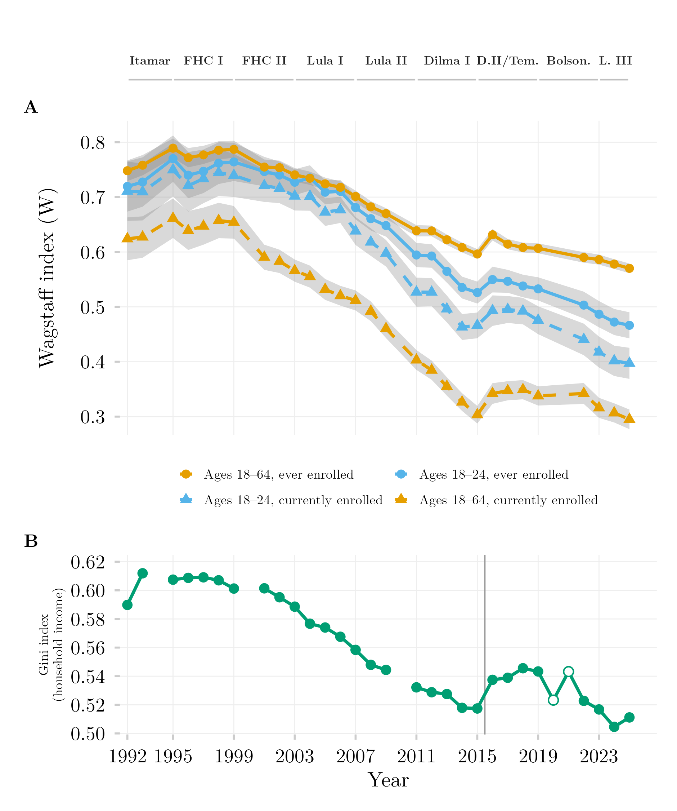

## Overview

This figure shows how strongly access to and enrollment in tertiary education have been tied to household income in Brazil, and how that relationship has evolved over time. It compares two outcomes — ever accessing tertiary education and currently being enrolled — with a companion panel showing the overall income Gini index for context. A value near zero on the concentration index means access is spread evenly across income levels (independent of ability to pay); a high value means access remains concentrated among the wealthy.

## Methodology

Panel A. The Wagstaff concentration index (W) is a Gini-like scalar bounded for binary outcomes: W approaching zero indicates access has become de-commodified — independent of household income — while a high, positive W indicates access remains a commodity, allocated chiefly by ability to pay. W is computed via weighted survey GLM regression under a uniform Kish design-effect approximation (DEFF = 2.0) across both PNAD Anual and PNAD Contínua to preserve longitudinal comparability across the instrument transition. Grey bands are 95% confidence intervals. Solid lines/circles denote ever accessed tertiary education (`ens_sup`); dashed lines/triangles denote currently enrolled (`ens_sup_a`). Labels along the top mark each presidential administration's term. Panel B. The Gini index of household per-capita income, from the same official IBGE series used throughout, validated against IBGE's own published figures (mean deviation −0.0001). The vertical line marks the 2015/2016 PNAD Anual/PNAD Contínua splice; open circles mark the retroweighted, telephone-collected 2020–2021 PNAD Contínua, plotted but not asserted comparable to the rest of the series.

## Pipeline

Scripts for this analysis:

- Plotting: [`plot.R`](plot.R)
- Upstream pipeline:
  - [`shared-pipeline/pnadc/035_Splice_Microdados.R`](../../shared-pipeline/pnadc/035_Splice_Microdados.R)
  - [`shared-pipeline/pnadc/238_Serie_Desigualdade_Oficial.R`](../../shared-pipeline/pnadc/238_Serie_Desigualdade_Oficial.R)

## Reproducibility

**Tier: A**

This pipeline uses only public data, accessible via package/API without any credential (PNADcIBGE, censobr, sidrar, ipeadatar). Run the scripts in `shared-pipeline/` in numeric order to reconstruct the intermediate data.
