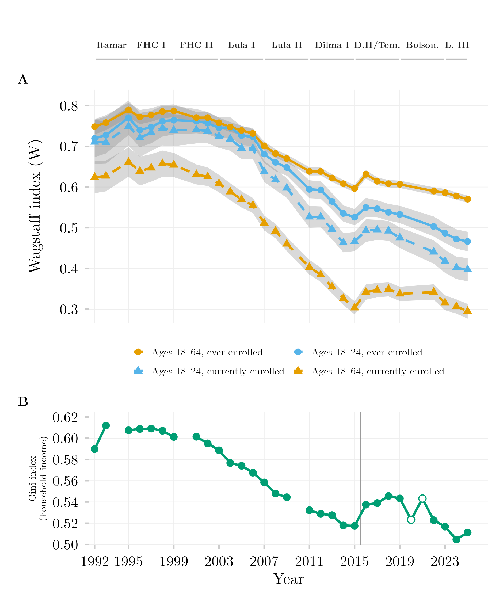

## Overview

This figure shows how strongly access to and enrollment in tertiary education have been tied to household income in Brazil, and how that relationship has evolved over time. It compares two outcomes — ever accessing tertiary education and currently being enrolled — with a companion panel showing the overall income Gini index for context. A value near zero on the concentration index means access is spread evenly across income levels (independent of ability to pay); a high value means access remains concentrated among the wealthy.

## Methodology

Panel A. The Wagstaff concentration index (W) is a Gini-like scalar bounded for binary outcomes: W approaching zero indicates access has become de-commodified — independent of household income — while a high, positive W indicates access remains a commodity, allocated chiefly by ability to pay. W is computed via weighted survey GLM regression under a uniform Kish design-effect approximation (DEFF = 2.0) across both PNAD Anual and PNAD Contínua to preserve longitudinal comparability across the instrument transition. Grey bands are 95% confidence intervals. Solid lines/circles denote ever accessed tertiary education (`ens_sup`); dashed lines/triangles denote currently enrolled (`ens_sup_a`). Labels along the top mark each presidential administration's term. Panel B. The Gini index of household per-capita income, from the same official IBGE series used throughout, validated against IBGE's own published figures (mean deviation −0.0001). The vertical line marks the 2015/2016 PNAD Anual/PNAD Contínua splice; open circles mark the retroweighted, telephone-collected 2020–2021 PNAD Contínua, plotted but not asserted comparable to the rest of the series.

## How to Cite

If you use this figure or the pipeline behind it, please cite both the dissertation and this specific analysis. References follow APA 7th edition.

**Dissertation (in preparation; the entry will be updated after the defense):**

> Mançano, T. (2026). *Inequality in access to tertiary education in Brazil: Household incomes, reforming policies, and the politics of who gets in (1990s–2020s)* [Unpublished master's thesis]. University of São Paulo.

**This figure and pipeline:**

> Mançano, T. (2026, August 27). *Inequality in tertiary education access and enrollment (Wagstaff index)* [Figure and reproducible pipeline]. Open Data Analysis. https://mancano-tales.github.io/open-data-analysis/posts/wagstaff-acesso-matricula/

**In text:** (Mançano, 2026) — when citing several analyses from this catalog in the same work, APA distinguishes them as 2026a, 2026b, … in the order they appear in the reference list.

**BibTeX:**

```bibtex
@mastersthesis{Mancano2026Thesis,
  author = {Man\c{c}ano, Tales},
  title  = {Inequality in Access to Tertiary Education in Brazil: Household
            Incomes, Reforming Policies, and the Politics of Who Gets In
            (1990s--2020s)},
  school = {University of S\~{a}o Paulo},
  year   = {2026},
  type   = {Master's thesis},
  note   = {Unpublished; Graduate Program in Political Science}
}

@misc{Mancano2026_wagstaff_acesso_matricula,
  author       = {Man\c{c}ano, Tales},
  title        = {Inequality in tertiary education access and enrollment (Wagstaff index)},
  year         = {2026},
  month        = aug,
  howpublished = {Open Data Analysis, \url{https://mancano-tales.github.io/open-data-analysis/posts/wagstaff-acesso-matricula/}},
  note         = {Figure and reproducible pipeline. Source code: \url{https://github.com/mancano-tales/open-data-analysis}, folder posts/wagstaff-acesso-matricula/. Accessed YYYY-MM-DD}
}
```

A permanent version (Git tag + Zenodo DOI) will be linked here once the dissertation is defended; until then, cite the page URL above and add the date you accessed it (source code: https://github.com/mancano-tales/open-data-analysis, folder `posts/wagstaff-acesso-matricula/`).

## Pipeline

This figure draws on the [PNAD / PNAD Contínua Harmonization, 1992–2025](../harmonizacao-pnad-pnadc/) panel.

Run these scripts in this order, from the project root (each one writes to `data-raw/`, which the next one reads):

1. [`shared-pipeline/pnadc/000_PNADC_Download_Consolidate.R`](../../shared-pipeline/pnadc/000_PNADC_Download_Consolidate.R) — downloads PNAD Contínua 2012–2025 (1st interview) with `PNADcIBGE::get_pnadc()` into `data-raw/pnadc_raw/` and consolidates it into `data-raw/pnadc_consolidado_2012_2025_interview1.rds`
2. [`shared-pipeline/pnadc/020_PNAD_Anual_Manual_Import_2001_2015.R`](../../shared-pipeline/pnadc/020_PNAD_Anual_Manual_Import_2001_2015.R) — downloads the PNAD Anual 2001–2015 microdata from the IBGE FTP into `data-raw/pnad_anual_raw/` and imports them into `data-raw/harmonizing-br-data/output/PNAD_Anual_2001_2015.parquet`
3. [`shared-pipeline/pnadc/050_PNAD_Historica_Manual_Import_1992_1999.R`](../../shared-pipeline/pnadc/050_PNAD_Historica_Manual_Import_1992_1999.R) — same for PNAD Anual 1992–1999 (`PNAD_Anual_1992_1999.parquet`)
4. [`shared-pipeline/pnadc/021_PNAD_Anual_Import_Com_Renda_Zero.R`](../../shared-pipeline/pnadc/021_PNAD_Anual_Import_Com_Renda_Zero.R) — re-imports PNAD Anual 2001–2015 keeping zero-income households (`PNAD_Anual_2001_2015_com_zero.parquet`), which script 238 needs
5. [`shared-pipeline/pnadc/035_Splice_Microdados.R`](../../shared-pipeline/pnadc/035_Splice_Microdados.R) — splices PNAD Anual and PNAD Contínua into the harmonized panel — `Microdados_Todas_Idades_1992_2025.parquet` and `Microdados_Jovens_18_24_1992_2025.parquet` in `data-raw/harmonizing-br-data/output/` (sources `shared-pipeline/utils/codigos_curso_pnad.R`)
6. [`shared-pipeline/pnadc/238_Serie_Desigualdade_Oficial.R`](../../shared-pipeline/pnadc/238_Serie_Desigualdade_Oficial.R) — derives the official income-inequality series (`238_serie_desigualdade_oficial.rds`). Optional input: `PNADC_Visita5_2019_2022.parquet` (PNAD Contínua 5th-interview microdata, not built by any script in this repository) grafts the 2020–2021 points; without it those two years are simply absent
7. [`plot.R`](plot.R) — reads `Microdados_Todas_Idades_1992_2025.parquet` and `238_serie_desigualdade_oficial.rds`; writes the figure to `output/figures/wagstaff-acesso-matricula/` — compare it with this post's `thumbnail.png`

All of the upstream steps above are Tier A and are also run, in this same order, by [`shared-pipeline/build_public_data.R`](../../shared-pipeline/build_public_data.R).

## Reproducibility

**Tier: A**

This pipeline uses only public data, accessible via package/API without any credential (PNADcIBGE, censobr, sidrar, ipeadatar). Run the scripts in `shared-pipeline/` in numeric order to reconstruct the intermediate data.
